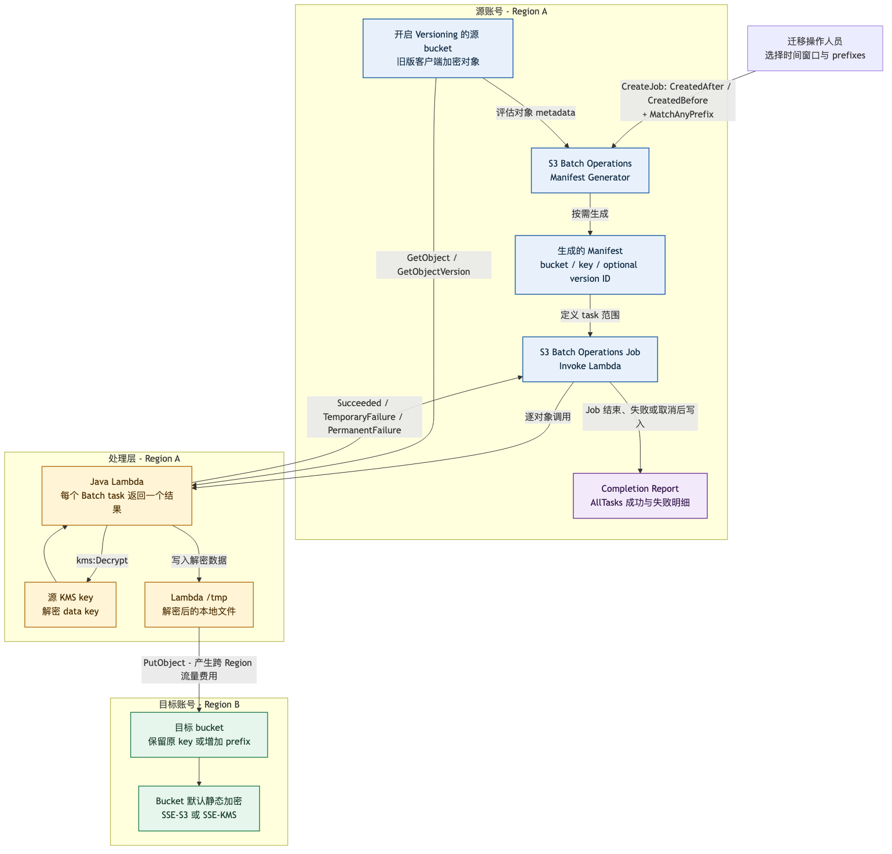

# S3 Batch Operations + Lambda 解密迁移设计

## 1. 文档信息

| 项目 | 内容 |
| --- | --- |
| 状态 | Draft |
| 目标读者 | 架构评审人员、迁移任务操作人员、数据所有者 |
| 实现目录 | `s3-lambda` |
| 核心服务 | Amazon S3 Batch Operations、AWS Lambda、AWS KMS、Amazon S3 |
| 设计目标 | 批量解密旧版 AWS SDK v1 客户端加密对象，并跨账号写入目标 S3 bucket |

## 2. 摘要

本方案使用 S3 Batch Operations 的 manifest generator 按需生成对象列表，并对列表中的每个对象调用 Java Lambda。Lambda 使用旧版 AWS SDK v1 `AmazonS3Encryption` 客户端和源 KMS key 解密对象，将明文暂存到 Lambda `/tmp`，再使用 `PutObject` 写入目标 bucket。目标端静态加密完全由目标 bucket 的默认 SSE 配置负责。

方案依赖 S3 Batch Operations completion report 对任务进行对账。报告记录每个 task 的 bucket、key、可选 version、结果状态和错误信息，可回答“计划处理多少、成功多少、失败多少以及失败原因”。它提供的是迁移任务的**处理完整性和可追踪性**，不是解密前后内容的端到端密码学校验。

## 3. 目标与非目标

### 3.1 目标

- 使用 AWS 托管的 S3 Batch Operations 调度大规模对象处理。
- 按时间窗口和一个或多个 key prefix 筛选对象。
- 解密旧版 AWS SDK v1 client-side KMS encrypted objects。
- 将解密结果写入另一个 AWS 账号中的目标 bucket。
- 使用 completion report 统计所有 task 的成功、失败和失败原因。
- 支持 AWS 对临时失败的 redrive，并允许根据失败报告创建后续重跑任务。
- 明确跨账号、跨 Region、IAM、容量和成本边界。

### 3.2 非目标

- 不实现自定义 checksum、源目标内容比对或二次全量扫描。
- 不在 Lambda 中指定目标 SSE key；目标 bucket 的默认加密策略是唯一配置来源。
- 不替代 S3 Batch Operations 的任务状态、重试或 completion report。
- 不处理超过当前 Lambda 运行时、`/tmp` 或单次 `PutObject` 能力的超大对象。
- 不保证 task 只执行一次；整个链路按可重试、允许少量重复处理设计。

## 4. 架构图



图的可编辑源文件为 [`docs/batch-ops-lambda-flow.mmd`](docs/batch-ops-lambda-flow.mmd)。

## 5. 组件职责

### 5.1 Manifest generator

S3 Batch Operations 在创建 job 时按需生成对象列表。生成过程是异步的，job 会先处于准备阶段。耗时通常受源 bucket 对象规模、筛选条件和 AWS 服务调度影响；AWS 不提供固定生成时间 SLA，因此不能把创建 job 到开始执行的时间视为常量。

本方案启用 manifest 输出并保存生成结果，形成可审计的输入范围。支持的主要过滤条件是：

- `CreatedAfter`：只包含该时间之后创建或覆盖的当前对象。
- `CreatedBefore`：只包含该时间之前创建或覆盖的当前对象。
- `KeyNameConstraint.MatchAnyPrefix`：只包含匹配任一 prefix 的 key。

AWS 文档将时间条件称为 object creation date。对 S3 当前对象版本，可将其理解为该版本的创建/`LastModified` 时间。同一个 key 被覆盖后，新版本具有新的时间，因此可能落入新的时间窗口。

限制：S3 Batch Operations 不支持跨 Region object list generation。source bucket、job 和 manifest 生成/保存位置必须按照 AWS 的同 Region 要求配置。目标 bucket 可以位于其他 Region。

### 5.2 S3 Batch Operations job

Job 使用 `LambdaInvoke` operation，并为 manifest 中的对象创建 task。S3 Batch Operations 异步调度这些 task，执行顺序不保证与 manifest 顺序一致。

Job 必须启用 completion report，并设置：

```text
ReportScope=AllTasks
```

只使用 `FailedTasksOnly` 会保留失败详情，但不适合做完整的成功/失败对账。

Job status 为 `Complete` 只表示所有 task 已经结束，不表示每个 task 都成功。最终结论必须同时检查 job status、job counters 和 completion report。

### 5.3 Java Lambda

Handler：

```text
com.dailytools.s3migration.batchlambda.S3BatchDecryptCopyHandler::handleRequest
```

每个 task 的处理步骤：

1. 解析 `taskId`、source bucket ARN、URL-encoded key 和可选 `versionId`。
2. 使用 `AmazonS3Encryption` 和 `KMSEncryptionMaterialsProvider` 调用 `GetObject` 或 `GetObjectVersion`。
3. AWS KMS 解密对象 metadata 中保存的 encrypted data key。
4. 将解密后的明文写入唯一的 `/tmp/s3-batch-decrypt-<UUID>.bin`。
5. 使用普通 S3 client 将本地文件上传到 `TARGET_BUCKET`。
6. 保持原 key，或者在前面增加 `TARGET_KEY_PREFIX`。
7. 删除本地临时文件。
8. 返回每个 task 的结果状态和受长度限制的结果说明。

结果状态：

| Lambda 结果 | 含义 | Batch Operations 行为 |
| --- | --- | --- |
| `Succeeded` | 解密和上传都成功 | 记录成功 |
| `TemporaryFailure` | 网络、I/O、throttling、5xx 等临时错误 | 在 job 结束前 redrive |
| `PermanentFailure` | 参数、权限、对象格式或其他非临时错误 | 记录失败，不自动按临时错误重试 |

未返回的 task 默认按 `TemporaryFailure` 处理。

#### 5.3.1 什么是 `TemporaryFailure`

> **`TemporaryFailure` 表示当前 task 可以由 S3 Batch Operations 在本次 job 结束前再次执行。它不是最终失败状态，也不需要操作人员立即创建 retry job。**

当前 Java 实现沿 exception cause chain 检查异常。符合以下任一条件时返回 `TemporaryFailure`：

| 当前实现的判定条件 | 常见示例 |
| --- | --- |
| `SdkClientException` | AWS SDK 网络连接中断、客户端超时 |
| `IOException` | 下载、解密文件写入或上传文件读取时的 I/O 错误 |
| AWS HTTP status `429` | 请求被限流 |
| AWS HTTP status `500`、`502`、`503`、`504` | S3、KMS 或相关服务的临时服务端错误 |
| AWS error code 包含 `throttl` | KMS/S3 throttling |
| AWS error code 包含 `slowdown` | S3 `SlowDown` |
| AWS error code 包含 `timeout` | AWS service timeout |
| AWS error code 包含 `requestlimit` | 请求速率超过限制 |
| AWS error code 包含 `provisionedthroughput` | KMS 等服务的吞吐限制 |
| Lambda response 缺少某个输入 `taskId` | `treatMissingKeysAs` 默认为 `TemporaryFailure` |

S3 Batch Operations 会在当前 job 内 redrive 该 task。若后续执行成功，最终报告为成功；若最后一次 redrive 仍失败，completion report 才会将其列为最终失败对象。AWS 不提供由调用方设置的固定 redrive 次数。

`AccessDenied`、无效参数、错误的 KMS/crypto 配置以及不受支持的对象格式通常应视为 `PermanentFailure`，因为不修改配置就无法通过重试恢复。Lambda 整体 timeout 发生在 handler 返回结果之前，不经过上述 Java 分类逻辑。

### 5.4 源 bucket 与源 KMS

- Lambda execution role 需要 `s3:GetObject` 和 `s3:GetObjectVersion`。
- 源 bucket policy 必须允许该 role 读取对象。
- Lambda execution role 和源 KMS key policy 必须允许 `kms:Decrypt`。
- 每个 Lambda 配置一个 `SOURCE_KMS_KEY_ID`、crypto mode 和 metadata storage mode。同一 job 中的对象必须与该配置兼容；使用其他 client-side KMS key 或 crypto format 的对象应拆分到另一 Lambda 配置/job。
- 如果 task 包含 `versionId`，Lambda 精确读取该版本；如果没有，则读取执行时的最新版本。迁移期间应冻结源写入，或者确保 manifest 包含 version ID，避免 job 运行过程中 key 被覆盖后读取到不同版本。

### 5.5 跨账号目标 bucket

`TARGET_BUCKET` 只配置 bucket name，不配置 ARN 或 `s3://` URI。跨账号授权由以下两部分共同完成：

- Lambda execution role identity policy 允许目标对象 ARN 上的 `s3:PutObject`。
- 目标 bucket policy 允许源账号中的 Lambda execution role 执行 `s3:PutObject`。

建议目标 bucket 使用 `Bucket owner enforced` Object Ownership。当前实现不发送 ACL；如果 bucket policy 强制 `bucket-owner-full-control` ACL，上传会被拒绝。

当前实现也不发送显式 SSE request header，而是依赖目标 bucket default encryption。如果 bucket policy 强制请求携带 `x-amz-server-side-encryption` header，即使 bucket 已启用默认加密，上传仍可能被拒绝。

目标默认加密有两种情况：

- **SSE-S3**：不需要目标 KMS 权限，也不会产生目标 KMS API request 费用。
- **SSE-KMS**：Lambda 不需要知道 key ID，但 execution role 和目标 KMS key policy 必须允许所需 KMS 操作，尤其是 `kms:GenerateDataKey`。跨账号场景应使用目标账号可授权的 customer managed KMS key，而不是依赖不可跨账号共享的 AWS managed key。

## 6. 端到端流程

1. 操作人员确认源写入已冻结，确定时间窗口、prefix 和目标位置。
2. 操作人员创建 S3 Batch Operations job，配置 manifest generator、Lambda ARN、Batch Operations role、completion report 和确认选项。
3. S3 根据时间和 prefix 条件评估源 bucket 对象，按需生成 object list，并将 manifest 保存到指定 bucket。
4. 操作人员在正式执行前检查 manifest 对象数、筛选条件、目标 Lambda version/alias 和 IAM 配置。
5. Batch Operations 为 manifest 中每个对象调度 Lambda task。
6. Lambda 下载并解密对象，在 `/tmp` 中形成明文文件。
7. Lambda 将明文上传到跨账号目标 bucket。若目标 bucket 位于其他 Region，该步骤跨 Region 传输。
8. 目标 S3 按 bucket default encryption 保存对象。
9. Lambda 返回 task 结果；临时错误由 Batch Operations redrive。
10. Job 结束、失败或被取消后，S3 写入 completion report。
11. 操作人员对比 manifest/job task count 与 completion report，确认成功和失败数量。
12. 操作人员修复失败原因，并使用失败任务生成新的 retry manifest/job。不要直接假设重跑整个原 manifest 不会产生重复版本或额外费用。

## 7. 数据完整性与对账

### 7.1 本方案能够保证什么

- **输入范围可追踪**：保存自动生成的 manifest，记录时间窗口和 prefix。
- **每个 task 有最终状态**：Lambda 为输入 task 返回成功、临时失败或永久失败。
- **结果可对账**：`AllTasks` completion report 包含 object key、可选 version、状态、错误码和错误说明。
- **失败可定位**：权限、KMS、对象不存在、解密格式和服务错误可以按 task 查询。
- **临时错误可恢复**：`TemporaryFailure` 由 S3 Batch Operations redrive。
- **源数据不被修改**：Lambda 只读取源对象并写入目标 bucket。

### 7.2 本方案不能单独证明什么

Completion report 证明 task 是否按照 Lambda 返回值完成，但不计算或比较解密后的业务内容 checksum。因此它不能单独证明：

- 解密后的明文符合业务语义。
- 源密文对应的明文与其他系统保存的期望 checksum 一致。
- 用户选择的时间窗口和 prefix 覆盖了业务上“应该迁移”的全部对象。

这些边界不属于当前实现范围。设计评审中应将“任务处理完整性”与“内容级密码学完整性”分开表述。

### 7.3 验收标准

一个 Batch Operations job 只有同时满足以下条件才可判定为迁移完成：

- Job 进入 terminal state，且不是因基础配置错误提前失败。
- 生成并保留 manifest 与 `AllTasks` completion report。
- `manifest task count = succeeded task count + final failed task count`。
- 所有 final failed task 已由数据所有者接受，或已经进入后续 retry job。
- Completion report、job ID、Lambda version、筛选窗口和 prefixes 被记录在迁移台账中。

## 8. 失败处理与恢复

- 网络、I/O、S3/KMS throttling 和常见 5xx 按第 5.3.1 节标记为 `TemporaryFailure`，由 Batch Operations 在当前 job 内 redrive。
- 权限、配置、无法识别的加密格式等通常成为 `PermanentFailure`，进入 completion report。
- 当 job 至少执行 1,000 个 task 后，如果 task failure rate 超过 50%，S3 Batch Operations 会使 job 失败。正式大规模运行前必须先执行小范围 pilot job。
- Task 可能因 redrive 而重复执行。目标 bucket 开启 versioning 时，重复上传同一 key 会产生额外版本，而不是破坏旧版本。
- Retry 前必须先修复共同根因，例如错误 KMS key、bucket policy、SCP、permissions boundary、目标 SSE-KMS key policy 或 Lambda timeout。
- Completion report 生成失败任务清单后，再创建单独 retry job。重跑成本按新的 Batch Operations task、Lambda、KMS 和 S3 requests 再次计算。

## 9. 容量与服务限制

- Lambda 最大运行时间为 15 分钟。对象的下载、解密、上传和清理必须在一次 invocation 内完成。
- Lambda ephemeral storage 必须大于最大解密文件，并保留运行时和并发所需余量。单个 invocation 使用独立执行环境，但 warm execution environment 可能复用 `/tmp`。
- 当前实现使用单次 `PutObject`，不使用 multipart upload，因此单对象不能超过 S3 `PutObject` 的 5 GB 上限。
- Lambda memory 同时影响 CPU 和网络能力。需要使用真实对象大小进行 pilot 测试后确定 memory、timeout 和 ephemeral storage。
- S3 Batch Operations 可以快速扩大并发。应使用 Lambda reserved concurrency 控制最大并发，使其不超过 KMS quota、目标 S3 policy 和账户并发承载能力。
- 大规模任务应固定 Lambda version ARN，避免 `$LATEST` 或 alias 在 job 中途切换实现。

## 10. Region 与网络费用

Manifest generator 不支持跨 Region object list generation。Batch Operations job 应在源 bucket 所在 Region 创建，Lambda 也部署在该处理 Region。

当目标 bucket 位于另一个 Region 时，Lambda 上传明文对象会跨 Region。AWS 会按 Region pair 和数据量收取 inter-Region data transfer 费用；目标 Region 的 data transfer in 通常不收费，但应以执行时的 AWS pricing 为准。

如果 Lambda 部署在与源、目标都不同的第三个 Region，可能形成两段跨 Region 流量，因此不采用这种部署方式。

## 11. 成本模型

实际费用随 Region、对象数、对象大小、Lambda memory/duration、重试率和存储类型变化。设计评审应按以下项目估算，而不是只计算 Lambda invocation：

| 成本项 | 计费驱动因素 | 说明 |
| --- | --- | --- |
| S3 Batch Operations job | Job 数量 | 每个正式 job 和 retry job 分别收费 |
| Manifest generation | 生成 manifest 涉及的对象 | 自动 manifest 是可选的独立计费项 |
| Batch Operations object tasks | Manifest task 数 | 按处理对象数量收费 |
| Lambda requests | Invocation 数和 redrive 数 | 通常随 task 数增长；重试会增加 |
| Lambda duration | Memory GB × 执行时间 | 包含下载、解密、上传以及初始化时间 |
| Lambda ephemeral storage | 超过免费基础容量的 GB-seconds | 仅在配置额外 `/tmp` 时产生 |
| Source S3 GET | 每次对象读取 | 归档/低频存储还可能产生 retrieval 费用 |
| Target S3 PUT | 每次对象上传和重试 | 重复处理会产生额外 PUT 和对象版本 |
| Source KMS | Client-side envelope key decrypt requests | 通常每个被解密对象至少涉及 KMS request；受 KMS pricing 和 free tier 影响 |
| Target KMS | 仅当目标默认 SSE-KMS | SSE-S3 没有该项；SSE-KMS 可能产生 `GenerateDataKey` 等请求费用 |
| Cross-Region transfer | 跨 Region 字节数 | 目标 bucket 与 Lambda Region 不同时产生 |
| Target storage | 写入字节数和版本数 | Versioning 下重复上传会保留额外版本 |
| CloudWatch Logs | 日志写入和保留量 | 高并发下应避免逐字节或过量 INFO 日志 |
| CloudTrail | 记录的数据事件数量 | 若为每个 S3 task 开启 data event，数量会随对象数增长 |

成本估算至少使用：

```text
object_count
average_and_p95_object_size
average_lambda_duration
lambda_memory
temporary_failure_rate
permanent_failure_rate
cross_region_total_bytes
target_encryption_mode
```

## 12. 安全与权限边界

### 12.1 Batch Operations role

最小权限包括：

- 创建/读取生成的 manifest 所需权限。
- `lambda:InvokeFunction`，限定到固定 Lambda version ARN。
- 写入 completion report bucket 的权限。

### 12.2 Lambda execution role

最小权限包括：

- 源对象的 `s3:GetObject`、`s3:GetObjectVersion`。
- 源 KMS key 的 `kms:Decrypt`。
- 目标对象 ARN 的 `s3:PutObject`。
- CloudWatch Logs 写入权限。
- 如果目标默认使用 SSE-KMS，增加目标 KMS key 所需权限。

### 12.3 Resource policies

- 源 bucket policy 和源 KMS key policy允许 Lambda execution role。
- 目标 bucket policy允许该跨账号 role 写入限定 prefix。
- 目标 SSE-KMS key policy允许该跨账号 role 通过 S3 使用 key。
- SCP、permissions boundary、session policy 和 S3 VPC endpoint policy 均不能存在冲突的 explicit deny。

## 13. 运维与上线策略

1. 使用少量 prefix 和窄时间窗口创建 pilot manifest。
2. 运行 pilot job，验证源加密格式、KMS 权限、目标 ownership、默认 SSE 和 completion report。
3. 根据真实 duration 设置 Lambda memory、timeout、ephemeral storage 和 reserved concurrency。
4. 检查 pilot report，确保成功/失败数量可解释。
5. 使用固定 Lambda version ARN 创建正式 job，并保留人工确认步骤。
6. 运行期间监控 Batch Operations progress、Lambda errors/throttles/duration、KMS throttling 和目标 S3 4xx/5xx。
7. Job 结束后执行第 7.3 节的对账标准。
8. 修复失败根因后，为失败对象创建独立 retry job，并保留其 manifest 和 report。

## 14. 关键架构决策

| 决策 | 选择 | 原因 |
| --- | --- | --- |
| 对象发现 | S3 Batch Operations manifest generator | 无需等待每日 Inventory，可按需生成并筛选 |
| 调度 | S3 Batch Operations | AWS 托管大规模 task 调度、redrive 和报告 |
| 解密 | Java Lambda + AWS SDK v1 `AmazonS3Encryption` | 兼容现有 legacy client-side KMS encryption format |
| 目标加密 | Target bucket default SSE | 不在 Lambda 中暴露或误配目标 key ID |
| 完整性证据 | Manifest + `AllTasks` completion report | 使用 AWS 原生能力完成 task 级对账 |
| 跨账号 | Lambda role + target bucket/key resource policies | 权限边界明确，符合 least privilege |
| 重复处理 | 接受 at-least-once，目标 bucket versioning | 简化恢复，并保留被覆盖版本 |

## 15. AWS 参考资料

- [Creating an S3 Batch Operations job](https://docs.aws.amazon.com/AmazonS3/latest/userguide/batch-ops-create-job.html)
- [Invoke AWS Lambda function with S3 Batch Operations](https://docs.aws.amazon.com/AmazonS3/latest/userguide/batch-ops-invoke-lambda.html)
- [Tracking job status and completion reports](https://docs.aws.amazon.com/AmazonS3/latest/userguide/batch-ops-job-status.html)
- [S3 Batch Operations completion report examples](https://docs.aws.amazon.com/AmazonS3/latest/userguide/batch-ops-examples-reports.html)
- [Amazon S3 pricing](https://aws.amazon.com/s3/pricing/)
- [AWS Lambda pricing](https://aws.amazon.com/lambda/pricing/)
- [AWS KMS pricing](https://aws.amazon.com/kms/pricing/)
