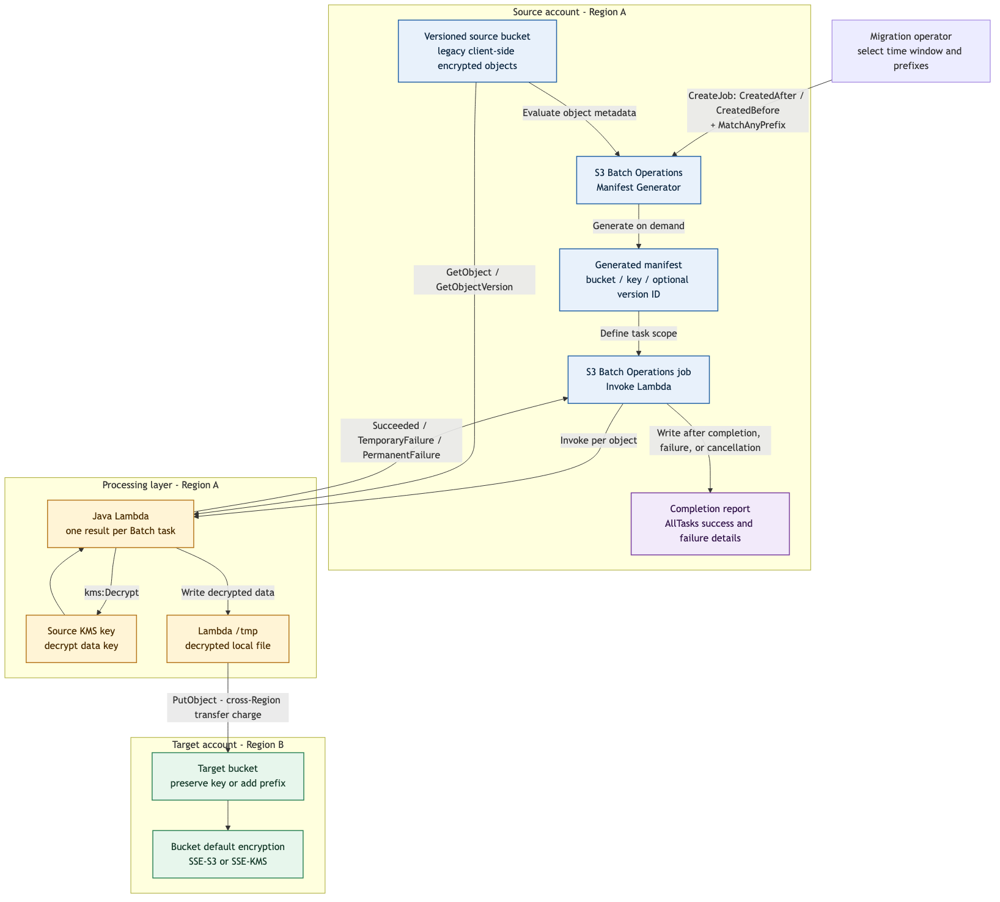

# S3 Batch Operations + Lambda Decryption Migration Design

## 1. Document Information

| Item | Description |
| --- | --- |
| Status | Draft |
| Intended audience | Architecture reviewers, migration operators, and data owners |
| Implementation directory | `s3-lambda` |
| Core services | Amazon S3 Batch Operations, AWS Lambda, AWS KMS, and Amazon S3 |
| Design objective | Decrypt legacy AWS SDK v1 client-side encrypted objects and write them to a target S3 bucket in another AWS account |

## 2. Executive Summary

This solution uses the S3 Batch Operations manifest generator to create an object list on demand. S3 Batch Operations invokes a Java Lambda function for the objects in that list. The Lambda function uses the legacy AWS SDK v1 `AmazonS3Encryption` client and the source KMS key to decrypt each object, temporarily stores the plaintext in Lambda `/tmp`, and uploads it to the target bucket with `PutObject`. Server-side encryption at the destination is controlled exclusively by the target bucket's default encryption configuration.

The solution uses an S3 Batch Operations completion report for task reconciliation. The report records the bucket, key, optional version, result status, and error details for each task. It answers how many objects were scheduled, how many succeeded, how many failed, and why they failed. This provides **processing completeness and traceability**, not an end-to-end cryptographic comparison of the decrypted content.

## 3. Goals and Non-Goals

### 3.1 Goals

- Use AWS-managed S3 Batch Operations to schedule object processing at scale.
- Filter objects by a time window and one or more key prefixes.
- Decrypt legacy AWS SDK v1 client-side KMS encrypted objects.
- Write decrypted results to a target bucket in another AWS account.
- Use completion reports to account for successful and failed tasks and their failure reasons.
- Use AWS redrive behavior for temporary failures and support follow-up jobs for final failures.
- Make cross-account, cross-Region, IAM, capacity, and cost boundaries explicit.

### 3.2 Non-Goals

- Implement a custom checksum, source-to-target content comparison, or a second full scan.
- Specify the target SSE key in Lambda; target bucket default encryption remains the single source of truth.
- Replace Batch Operations job status, retry handling, or completion reports.
- Process objects that exceed the current Lambda runtime, `/tmp`, or single-request `PutObject` limits.
- Guarantee exactly-once task execution. The workflow is retryable and accepts a small amount of duplicate processing.

## 4. Architecture Diagram



The editable diagram source is [`docs/batch-ops-lambda-flow-en.mmd`](docs/batch-ops-lambda-flow-en.mmd).

## 5. Component Responsibilities

### 5.1 Manifest Generator

S3 Batch Operations generates the object list on demand when the job is created. Generation is asynchronous, and the job first enters a preparation phase. Duration is generally influenced by source bucket scale, filter selectivity, and AWS service scheduling. AWS does not publish a fixed generation-time SLA, so the interval between job creation and task execution must not be treated as constant.

The generated manifest is saved to provide an auditable record of the job's input scope. The primary filters used by this design are:

- `CreatedAfter`: Include objects created or overwritten after the specified time.
- `CreatedBefore`: Include objects created or overwritten before the specified time.
- `KeyNameConstraint.MatchAnyPrefix`: Include keys matching any configured prefix.

AWS documentation calls the time value the object creation date. For the current S3 object version, it can be understood as that version's creation or `LastModified` time. Overwriting an existing key creates a new version with a new timestamp, which might place the key in a later time window.

S3 Batch Operations does not support cross-Region object list generation. The source bucket, job, and manifest generation/output location must follow AWS same-Region requirements. The target bucket may be located in another Region.

### 5.2 S3 Batch Operations Job

The job uses the `LambdaInvoke` operation and creates tasks for objects in the manifest. S3 Batch Operations schedules tasks asynchronously and does not guarantee manifest order.

The job must enable a completion report with:

```text
ReportScope=AllTasks
```

`FailedTasksOnly` preserves failure details but does not provide a complete success-versus-failure reconciliation.

A job status of `Complete` only means that all tasks have reached an outcome. It does not mean that every task succeeded. The final assessment must consider job status, job counters, and the completion report together.

### 5.3 Java Lambda

Handler:

```text
com.dailytools.s3migration.batchlambda.S3BatchDecryptCopyHandler::handleRequest
```

Each task follows these steps:

1. Parse the `taskId`, source bucket ARN, URL-encoded key, and optional `versionId`.
2. Call `GetObject` or `GetObjectVersion` through `AmazonS3Encryption` and `KMSEncryptionMaterialsProvider`.
3. Use AWS KMS to decrypt the encrypted data key stored in the object's metadata.
4. Write the decrypted plaintext to a unique `/tmp/s3-batch-decrypt-<UUID>.bin` file.
5. Upload the local file to `TARGET_BUCKET` using a standard S3 client.
6. Preserve the source key or prepend `TARGET_KEY_PREFIX`.
7. Delete the local temporary file.
8. Return a result status and a length-limited result message for each task.

Result codes:

| Lambda result | Meaning | Batch Operations behavior |
| --- | --- | --- |
| `Succeeded` | Decryption and upload both succeeded | Record success |
| `TemporaryFailure` | A potentially recoverable network, I/O, throttling, or service error occurred | Redrive before the job completes |
| `PermanentFailure` | A parameter, permission, object format, or other non-temporary error occurred | Record failure without temporary-failure redrive |

An input task omitted from the Lambda response defaults to `TemporaryFailure`.

#### 5.3.1 What Is `TemporaryFailure`?

> **`TemporaryFailure` means S3 Batch Operations may execute the task again before the current job finishes. It is not the task's final failure state, and the operator does not need to create a retry job immediately.**

The current Java implementation walks the exception cause chain. It returns `TemporaryFailure` when any of the following conditions is found:

| Current implementation condition | Typical example |
| --- | --- |
| `SdkClientException` | AWS SDK connection interruption or client timeout |
| `IOException` | I/O failure while downloading, writing decrypted data, or reading the upload file |
| AWS HTTP status `429` | Request throttling |
| AWS HTTP status `500`, `502`, `503`, or `504` | Temporary S3, KMS, or related service error |
| AWS error code contains `throttl` | KMS or S3 throttling |
| AWS error code contains `slowdown` | S3 `SlowDown` |
| AWS error code contains `timeout` | AWS service timeout |
| AWS error code contains `requestlimit` | Request-rate limit exceeded |
| AWS error code contains `provisionedthroughput` | KMS or another service throughput limit |
| Lambda response omits an input `taskId` | `treatMissingKeysAs` defaults to `TemporaryFailure` |

S3 Batch Operations redrives the task within the current job. A later successful attempt is reported as successful. If the final redrive still fails, the completion report lists the object as a final failure. AWS does not expose a caller-configurable fixed redrive count.

`AccessDenied`, invalid parameters, an incorrect KMS or crypto configuration, and unsupported object formats should generally be treated as `PermanentFailure` because retrying without a configuration change cannot resolve them. A Lambda function timeout occurs before the handler returns a result and therefore does not pass through this Java classification logic.

### 5.4 Source Bucket and Source KMS

- The Lambda execution role requires `s3:GetObject` and `s3:GetObjectVersion`.
- The source bucket policy must permit the role to read the source objects.
- The Lambda execution role and source KMS key policy must permit `kms:Decrypt`.
- Each Lambda configuration specifies one `SOURCE_KMS_KEY_ID`, crypto mode, and metadata storage mode. Objects in the same job must be compatible with that configuration. Objects using a different client-side KMS key or crypto format must use another Lambda configuration or job.
- When a task includes `versionId`, Lambda reads that exact version. Without a version ID, it reads the latest version at execution time. Source writes should be frozen during migration, or the manifest should include version IDs to prevent an overwrite during the job from changing the version that is processed.

### 5.5 Cross-Account Target Bucket

`TARGET_BUCKET` contains only the bucket name, not an ARN or `s3://` URI. Cross-account authorization requires both:

- A Lambda execution-role identity policy allowing `s3:PutObject` on the target object ARN.
- A target bucket policy allowing the source account's Lambda execution role to perform `s3:PutObject`.

The target bucket should use `Bucket owner enforced` Object Ownership. The current implementation does not send an ACL. A bucket policy that requires the `bucket-owner-full-control` ACL will reject the upload.

The implementation also does not send an explicit SSE request header. It relies on target bucket default encryption. A bucket policy that requires an `x-amz-server-side-encryption` request header can reject the upload even when default bucket encryption is enabled.

Target default encryption has two relevant modes:

- **SSE-S3**: No target KMS permission or target KMS API request charge is required.
- **SSE-KMS**: Lambda does not need the key ID, but the execution role and target KMS key policy must permit the required KMS actions, especially `kms:GenerateDataKey`. Cross-account access should use a customer managed KMS key in the target account rather than an AWS managed key that cannot be shared across accounts.

## 6. End-to-End Flow

1. The operator confirms that source writes are frozen and selects the time window, prefixes, and target location.
2. The operator creates an S3 Batch Operations job with a manifest generator, Lambda ARN, Batch Operations role, completion report, and confirmation requirement.
3. S3 evaluates source bucket objects using the time and prefix filters, generates the object list on demand, and saves the manifest.
4. Before activation, the operator reviews the manifest object count, filters, Lambda version or alias, target configuration, and IAM permissions.
5. Batch Operations schedules Lambda tasks for the objects in the manifest.
6. Lambda downloads and decrypts each object into a plaintext file in `/tmp`.
7. Lambda uploads the plaintext to the target bucket. This transfer crosses Regions when the target bucket is in another Region.
8. Target S3 applies the bucket's default server-side encryption.
9. Lambda returns a task result. Batch Operations redrives temporary failures.
10. S3 writes the completion report after the job completes, fails, or is cancelled.
11. The operator reconciles the manifest and job task count against the completion report.
12. After correcting failure causes, the operator creates a separate retry manifest and job for final failed objects. Rerunning the original manifest can create duplicate versions and additional charges.

## 7. Data Integrity and Reconciliation

### 7.1 What This Design Provides

- **Traceable input scope**: The generated manifest records the time window and prefixes.
- **A final status for every reported task**: Lambda returns success, temporary failure, or permanent failure.
- **Task reconciliation**: An `AllTasks` completion report contains the object key, optional version, status, error code, and error description.
- **Failure diagnosis**: Permission, KMS, missing object, crypto format, and service failures can be investigated per task.
- **Recovery from temporary errors**: S3 Batch Operations redrives `TemporaryFailure` tasks.
- **No source mutation**: Lambda reads source objects and writes only to the target bucket.

### 7.2 What This Design Does Not Prove

The completion report proves that a task completed according to the Lambda result. It does not compute or compare a business-level checksum of the decrypted plaintext. By itself, it cannot prove that:

- The decrypted plaintext is valid according to application semantics.
- The plaintext matches an expected checksum held by another system.
- The selected time window and prefixes cover every object that the business intended to migrate.

These controls are outside the current implementation scope. Architecture reviews must distinguish task-processing completeness from content-level cryptographic integrity.

### 7.3 Acceptance Criteria

A Batch Operations job is accepted as complete only when all of the following are true:

- The job has reached a terminal state and did not terminate early because of a foundational configuration error.
- The generated manifest and `AllTasks` completion report have been retained.
- `manifest task count = succeeded task count + final failed task count`.
- Every final failed task has been accepted by the data owner or placed into a follow-up retry job.
- The migration record includes the completion report, job ID, Lambda version, filter window, and prefixes.

## 8. Failure Handling and Recovery

- Network, I/O, S3/KMS throttling, and common 5xx errors are marked `TemporaryFailure` according to section 5.3.1 and redriven by Batch Operations within the current job.
- Permission, configuration, unsupported encryption format, and similar errors generally become `PermanentFailure` and appear in the completion report.
- After at least 1,000 tasks have run, S3 Batch Operations fails the job if the task failure rate exceeds 50 percent. A small pilot job is mandatory before a large production run.
- Redrive can execute a task more than once. With target bucket versioning enabled, repeated uploads of the same key create additional versions rather than destroying an older version.
- Before a retry, operators must correct shared root causes such as an incorrect KMS key, bucket policy, SCP, permissions boundary, target SSE-KMS key policy, or Lambda timeout.
- Completion-report failure CSV files must be converted into a valid two- or three-column S3 Batch Operations CSV manifest before creating a failed-only retry job.
- Retry costs include another Batch Operations task, Lambda invocation, KMS request, S3 GET, S3 PUT, and any applicable data transfer for every retried object.

## 9. Capacity and Service Limits

- Lambda has a maximum runtime of 15 minutes. Download, decryption, upload, and cleanup must finish within one invocation.
- Lambda ephemeral storage must exceed the largest decrypted object size and leave sufficient runtime headroom. Each invocation uses an isolated execution environment, but a warm execution environment can retain `/tmp` between invocations.
- The current implementation uses a single `PutObject` request rather than multipart upload. An object cannot exceed the 5 GB S3 `PutObject` limit.
- Lambda memory allocation also affects available CPU and network capacity. Memory, timeout, and ephemeral storage must be selected using pilot measurements from representative objects.
- S3 Batch Operations can increase invocation concurrency quickly. Lambda reserved concurrency should cap throughput below KMS quotas and account-level concurrency limits.
- Large jobs should reference an immutable Lambda version ARN so that changing `$LATEST` or an alias does not switch implementations during the job.

## 10. Region and Network Cost

The manifest generator does not support cross-Region object list generation. The Batch Operations job should be created in the source bucket Region, and Lambda should run in that processing Region.

When the target bucket is in another Region, Lambda uploads the plaintext across Regions. AWS charges inter-Region data transfer according to the Region pair and transferred bytes. Data transfer into the target Region is generally free, but the current AWS pricing page is authoritative at execution time.

Deploying Lambda in a third Region could introduce two cross-Region transfer legs and is therefore excluded from this design.

## 11. Cost Model

Actual cost varies by Region, object count, object size, Lambda memory and duration, retry rate, and source storage class. The estimate must include all of the following rather than only Lambda invocations:

| Cost item | Billing driver | Notes |
| --- | --- | --- |
| S3 Batch Operations job | Number of jobs | Production and retry jobs are charged separately |
| Manifest generation | Objects involved in generated manifests | On-demand manifest generation is a separately billed optional feature |
| Batch Operations object tasks | Number of manifest tasks | Charged by processed object count |
| Lambda requests | Invocations and redrives | Generally scales with task count; retries add requests |
| Lambda duration | Memory GB multiplied by execution time | Includes initialization, download, decryption, and upload time |
| Lambda ephemeral storage | GB-seconds above the included base capacity | Applies when additional `/tmp` is configured |
| Source S3 GET | Object reads | Archive and infrequent-access classes can also incur retrieval charges |
| Target S3 PUT | Uploads and retries | Duplicate processing adds PUT requests and object versions |
| Source KMS | Client-side envelope key decrypt requests | Decrypting an object normally involves a KMS request and is subject to KMS pricing and free-tier rules |
| Target KMS | Only when target default encryption is SSE-KMS | SSE-S3 has no target KMS request charge; SSE-KMS can incur `GenerateDataKey` and related request charges |
| Cross-Region transfer | Bytes transferred between Regions | Applies when the target bucket and Lambda are in different Regions |
| Target storage | Stored bytes and versions | Versioning retains additional versions created by duplicate uploads |
| CloudWatch Logs | Log ingestion and retention | Per-object INFO logging must remain controlled at high scale |
| CloudTrail | Number of recorded data events | Enabling S3 data events per task scales with object count |

At minimum, a cost estimate must include:

```text
object_count
average_and_p95_object_size
average_lambda_duration
lambda_memory
temporary_failure_rate
permanent_failure_rate
cross_region_total_bytes
target_encryption_mode
```

## 12. Security and Authorization Boundaries

### 12.1 Batch Operations Role

Minimum permissions include:

- Permissions required to generate and read the manifest.
- `lambda:InvokeFunction`, restricted to the immutable Lambda version ARN.
- Permission to write to the completion-report bucket.

### 12.2 Lambda Execution Role

Minimum permissions include:

- `s3:GetObject` and `s3:GetObjectVersion` on source objects.
- `kms:Decrypt` on the source KMS key.
- `s3:PutObject` on the target object ARN.
- CloudWatch Logs write permissions.
- Required target KMS permissions when target default encryption uses SSE-KMS.

### 12.3 Resource Policies

- The source bucket policy and source KMS key policy allow the Lambda execution role.
- The target bucket policy allows the cross-account role to write only to the intended prefix.
- The target SSE-KMS key policy allows the cross-account role to use the key through S3.
- SCPs, permissions boundaries, session policies, and S3 VPC endpoint policies contain no conflicting explicit deny.

## 13. Operational Rollout

1. Generate a pilot manifest with a small prefix and narrow time window.
2. Run the pilot job and verify source crypto compatibility, KMS access, target ownership, default SSE, and completion-report generation.
3. Use measured duration to configure Lambda memory, timeout, ephemeral storage, and reserved concurrency.
4. Reconcile the pilot report and explain every success and failure count.
5. Create the production job with an immutable Lambda version ARN and retain the manual confirmation step.
6. Monitor Batch Operations progress, Lambda errors/throttles/duration, KMS throttling, and target S3 4xx/5xx responses.
7. Apply the acceptance criteria in section 7.3 after the job ends.
8. Correct failure causes, then create a failed-only retry job and retain its manifest and completion report.

## 14. Key Architecture Decisions

| Decision | Choice | Rationale |
| --- | --- | --- |
| Object discovery | S3 Batch Operations manifest generator | Generates an object list on demand and supports metadata filters without waiting for a daily Inventory report |
| Scheduling | S3 Batch Operations | Provides AWS-managed task scheduling, redrive, and completion reporting |
| Decryption | Java Lambda with AWS SDK v1 `AmazonS3Encryption` | Preserves compatibility with the legacy client-side KMS encryption format |
| Target encryption | Target bucket default SSE | Avoids exposing or incorrectly configuring the target key ID in Lambda |
| Completeness evidence | Saved manifest plus `AllTasks` completion report | Uses AWS-native task-level reconciliation |
| Cross-account access | Lambda role plus target bucket and KMS resource policies | Establishes explicit least-privilege boundaries |
| Duplicate processing | Accept at-least-once behavior with target versioning | Simplifies recovery while retaining overwritten versions |

## 15. AWS References

- [Creating an S3 Batch Operations job](https://docs.aws.amazon.com/AmazonS3/latest/userguide/batch-ops-create-job.html)
- [Invoke AWS Lambda function with S3 Batch Operations](https://docs.aws.amazon.com/AmazonS3/latest/userguide/batch-ops-invoke-lambda.html)
- [Tracking job status and completion reports](https://docs.aws.amazon.com/AmazonS3/latest/userguide/batch-ops-job-status.html)
- [S3 Batch Operations completion report examples](https://docs.aws.amazon.com/AmazonS3/latest/userguide/batch-ops-examples-reports.html)
- [Amazon S3 pricing](https://aws.amazon.com/s3/pricing/)
- [AWS Lambda pricing](https://aws.amazon.com/lambda/pricing/)
- [AWS KMS pricing](https://aws.amazon.com/kms/pricing/)
